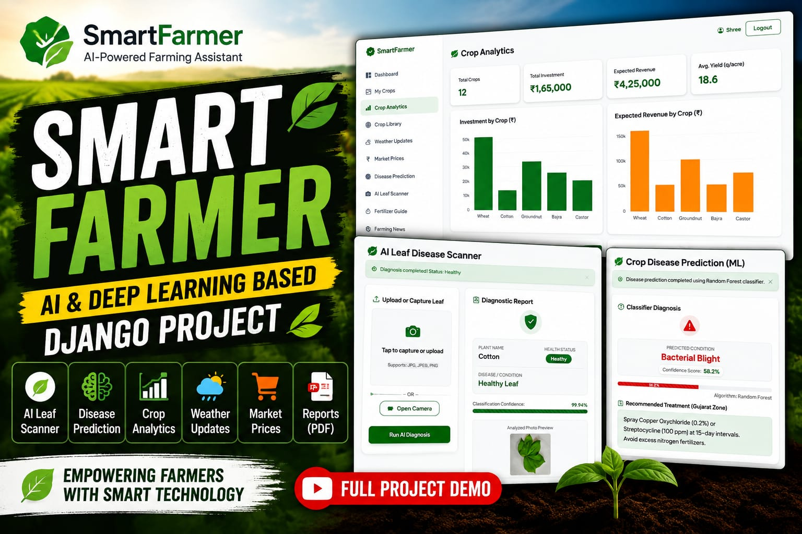

# 🌾 SmartFarmer – AI-Powered Smart Farming Assistant

*SmartFarmer* is a Django-based smart farming web application designed to help farmers make better farming decisions using *Machine Learning, Deep Learning, weather information, APMC market-price data, data analysis, visualization, web scraping, and agricultural guidance*.

The project is mainly designed around farming conditions in *Gujarat, India, with a focus on **Chadasna village, Taluka Himmatnagar, District Sabarkantha*.

SmartFarmer combines traditional farm-management features with intelligent features such as *crop disease prediction, Deep Learning leaf scanning, weather-based farming advice, market-price analysis, fertilizer guidance, farming news, and PDF diagnostic reports*.

---
### ▶️ Click the thumbnail below to watch the full demo on YouTube

[](https://youtu.be/QwVSuCP2hc0)


# 🚀 Key Modules & Features

## 📊 1. Dashboard & Farm Analytics

The dashboard gives the farmer a quick overview of farming activities and crop information.

It displays:

- Total cultivated land
- Total investment
- Expected revenue
- Expected yield
- Crop-wise information
- Crop progress
- Investment timeline

*Pandas* is used for processing and analyzing data, while *Plotly* is used to create interactive charts and visualizations.

The dashboard helps farmers understand their farming and financial information visually.

---

## 🌾 2. Crop Management – CRUD Operations

The Crop Management module allows farmers to maintain their crop records.

*CRUD means:*

- *Create* – Add a new crop
- *Read* – View crop information
- *Update* – Edit existing crop information
- *Delete* – Remove a crop record

Each crop record can contain:

- Crop name
- Crop variety
- Sowing date
- Estimated harvest date
- Land size in acres
- Investment cost
- Expected yield
- Expected revenue

The system can also calculate crop progress according to the sowing date and estimated harvest date.

---

## 📚 3. Crop Reference Library

SmartFarmer contains a searchable reference library containing information about common Indian crops.

The project currently contains information for *8 crops*:

1. Cotton
2. Groundnut
3. Maize
4. Bajra
5. Wheat
6. Castor
7. Cumin
8. Mustard

Information can include:

- Growing season
- Recommended soil
- Temperature requirements
- Rainfall requirements
- Common diseases
- Fertilizer information
- General cultivation guidance

This module provides farmers with basic crop information in one place.

---

## ☁️ 4. Weather Information & Farming Advice

SmartFarmer retrieves weather information using a *weather API*.

Weather information can include:

- Temperature
- Humidity
- Weather condition
- Rain conditions
- Wind information

Based on these environmental conditions, the application provides simple farming advice related to activities such as:

- Sowing
- Irrigation
- Pesticide spraying
- Harvesting

### Basic Workflow


Weather API
     ↓
Weather Data
     ↓
Temperature / Humidity / Rain
     ↓
Django Application
     ↓
Farming Advice
     ↓
Display to Farmer


This helps the farmer consider current weather conditions before performing farming activities.

---

# 📈 5. APMC / Mandi Market Price Analysis

SmartFarmer provides agricultural commodity-price information using *APMC market data*.

The module allows farmers to understand recent market-price movements.

Features include:

- Commodity prices
- Historical price information
- Average market price
- Highest price
- Lowest price
- Price trends
- Interactive charts

*Pandas* is used for data processing and analysis.

*Plotly* is used to create interactive market-price graphs.

### Basic Workflow
```

APMC Market Data
       ↓
Pandas Processing
       ↓
Price Analysis
       ↓
Average / High / Low
       ↓
Plotly Chart
       ↓
Display to Farmer
```

This feature helps farmers understand recent commodity-price trends before making selling decisions.

---

# 🤖 6. Machine Learning Disease Prediction

SmartFarmer includes a Machine Learning disease-prediction module.

This module uses *environmental and agricultural numerical features* to predict possible crop diseases.

The project uses Scikit-learn classification algorithms including:

- Decision Tree
- Random Forest
- K-Nearest Neighbors (KNN)

The input features are processed and passed to trained Machine Learning models.

Where supported, predict_proba() can be used to obtain class probabilities and display a confidence value.

### Machine Learning Workflow
```

Environmental / Crop Data
          ↓
Data Preprocessing
          ↓
Numerical Features
          ↓
Machine Learning Models
          ↓
Decision Tree / Random Forest / KNN
          ↓
Disease Prediction
          ↓
Probability / Confidence
          ↓
Final Result
```


This is the *traditional Machine Learning part* of SmartFarmer.

---

# 🌿 7. Deep Learning Leaf Scanner

SmartFarmer also contains a separate *Deep Learning Leaf Scanner*.

Unlike the Machine Learning disease predictor, which works with numerical/environmental features, the Leaf Scanner works directly with a *photograph of a plant leaf*.

The farmer can:

- Upload a leaf image from the device gallery
- Capture a leaf image using the camera/webcam

The image is then processed and passed to a trained *MobileNetV2-based Deep Learning model*.

### Technologies Used

- TensorFlow
- Keras
- MobileNetV2
- NumPy
- Image preprocessing
- JavaScript webcam/camera integration

---

## 📷 Leaf Scanner Complete Workflow

### Step 1 – Select or Capture Leaf Image

The farmer can select an existing leaf photograph from the gallery or capture an image using the camera/webcam.

*JavaScript* is used on the frontend to handle webcam/camera functionality.

JavaScript captures the image; it does *not* perform the disease prediction itself.

---

### Step 2 – Convert Image to RGB

The uploaded image is converted into standard:

*Red, Green and Blue (RGB)* format.

This ensures that images have a consistent colour format before being processed.

---

### Step 3 – Resize the Image

The image is resized to:

text
224 × 224 pixels


This is the image size expected by the MobileNetV2 model configuration used in the project.

---

### Step 4 – Convert Image to Numerical Data

The image pixels are converted into a *NumPy numerical array*.

A Deep Learning model processes numerical tensors/arrays rather than understanding the photograph directly as a human does.

---

### Step 5 – MobileNetV2 Prediction

The processed numerical image is passed to the trained *MobileNetV2 model*.

MobileNetV2 is a *Convolutional Neural Network (CNN) architecture* designed for efficient image-processing and classification tasks.

The model produces prediction scores/probabilities for the available classes.

---

### Step 6 – Select Highest Prediction

NumPy's argmax() is used to identify the class with the highest prediction score.

Example:

python
predicted_class = np.argmax(predictions)


---

### Step 7 – Convert Class Number to Class Name

The selected class index is converted into a readable class name using the project's class-name mapping.

For example:

text
Cotton_Leaf_Spot


---

### Step 8 – Display Prediction

The final result can display:

- Plant/crop name
- Predicted disease
- Health/disease status
- Confidence percentage

### Easy Flow to Remember
```

Leaf Photo
    ↓
RGB
    ↓
224 × 224
    ↓
NumPy Numerical Array
    ↓
MobileNetV2
    ↓
Prediction Scores
    ↓
Highest Class
    ↓
Class / Disease Name
    ↓
Confidence %
    ↓
Final Result
```

---

# 🧠 Machine Learning vs Deep Learning in SmartFarmer

SmartFarmer uses *both Machine Learning and Deep Learning*, but for different purposes.

| Machine Learning | Deep Learning |
|---|---|
| Uses numerical/environmental data | Uses leaf images |
| Scikit-learn | TensorFlow/Keras |
| Decision Tree | MobileNetV2 |
| Random Forest | CNN-based architecture |
| KNN | Image classification |
| Predicts from features | Predicts from leaf photographs |

So the two modules should not be confused.

*Machine Learning:*

text
Environmental Data → DT/RF/KNN → Disease Prediction


*Deep Learning:*

text
Leaf Image → MobileNetV2 → Disease/Health Classification


---

# 📄 8. PDF Diagnostic Report Generator

SmartFarmer can generate structured PDF diagnostic reports.

The PDF functionality is implemented using *ReportLab*.

A report can contain information such as:

- Farmer information
- Crop information
- Environmental parameters
- Prediction result
- Prediction confidence
- Disease information
- Treatment/guidance information
- Important disclaimer

### Workflow

text
Prediction Result
       ↓
Diagnostic Information
       ↓
ReportLab
       ↓
PDF Generation
       ↓
Diagnostic Report


This allows prediction information to be stored or shared in a readable document format.

> *Important:* AI and Machine Learning predictions are intended as decision-support information and should not replace professional agricultural or plant-pathology advice.

---

# 🧪 9. Soil & Fertilizer Guidance

SmartFarmer provides fertilizer guidance based on information such as:

- Selected crop
- Crop growth stage
- Soil type
- N-P-K requirements

### N-P-K Meaning

- *N – Nitrogen*
- *P – Phosphorus*
- *K – Potassium*

The application uses predefined agricultural rules to calculate or adjust fertilizer recommendations.

For example, different soil conditions may require adjustments to recommended fertilizer quantities.

### Basic Workflow


Crop
  +
Growth Stage
  +
Soil Type
  ↓
N-P-K Requirement
  ↓
Recommendation Rules
  ↓
Fertilizer Guidance


---

# 📰 10. Farming News Aggregator

SmartFarmer contains a farming-news module that collects agriculture-related information from supported public web sources.

Technologies used:

- BeautifulSoup4
- Requests
- Python

### Workflow

text
Public Web Source
       ↓
HTTP Request
       ↓
HTML Content
       ↓
BeautifulSoup
       ↓
Parse HTML
       ↓
Extract Relevant News
       ↓
Remove Duplicates
       ↓
Display News


*BeautifulSoup* is a Python library used for parsing HTML and extracting required information from webpages.

---

# 📊 11. Data Analysis & Visualization

SmartFarmer uses *Pandas* for data manipulation and analysis.

Pandas can be used for:

- Reading structured data
- Cleaning data
- Filtering records
- Calculating averages
- Grouping information
- Preparing data for visualization

The project uses *Plotly* for interactive visualizations.

Charts can be used for:

- Crop investment
- Expected revenue
- Land allocation
- Market-price trends
- Crop analytics

---

# 🗄️ 12. Database

SmartFarmer uses *SQLite* as its database for development.

Django's ORM allows the application to communicate with the database using Python objects.

For example, instead of manually writing SQL queries throughout the application, Django models can be used to create, retrieve, update and delete records.

The database stores application information such as crop and user-related records required by the system.

---

# 🛠️ Technology Stack

| Category | Technology |
|---|---|
| Programming | Python, JavaScript |
| Backend | Django 4.2.x |
| Frontend | HTML5, CSS3, Bootstrap 5, JavaScript |
| Database | SQLite |
| Machine Learning | Scikit-learn |
| ML Algorithms | Decision Tree, Random Forest, KNN |
| Deep Learning | TensorFlow, Keras |
| Image Model | MobileNetV2 |
| Image/Data Processing | NumPy |
| Data Analysis | Pandas |
| Visualization | Plotly |
| Web Scraping | BeautifulSoup4, Requests |
| PDF Generation | ReportLab |
| External Data | Weather API, APMC Market Data |
| Version Control | Git, GitHub |

---

# 🏗️ Simplified System Architecture
```

                         SMARTFARMER
                              │
              ┌───────────────┴───────────────┐
              │                               │
          FRONTEND                         BACKEND
              │                               │
   HTML / CSS / Bootstrap                 Django
        JavaScript                           │
              │                              │
              └──────────────┬───────────────┘
                             │
              ┌──────────────┼──────────────┐
              │              │              │
           Database      External Data     AI / ML
              │              │              │
           SQLite       Weather / APMC      │
                                             │
                                    ┌────────┴────────┐
                                    │                 │
                              Machine Learning   Deep Learning
                                    │                 │
                              DT / RF / KNN       MobileNetV2
                                    │                 │
                              Numerical Data       Leaf Image

```
---

# 📁 Project Structure

```
SmartFarmer/
│
├── core/
│   ├── views.py
│   ├── urls.py
│   ├── forms.py
│   └── ...
│
├── crops/
│   ├── models.py
│   ├── views.py
│   ├── urls.py
│   ├── ml/
│   └── ...
│
├── templates/
│   └── ...
│
├── static/
│   ├── css/
│   ├── js/
│   └── images/
│
├── db.sqlite3
├── manage.py
├── requirements.txt
├── .gitignore
└── README.md
```


> *Note:* The exact folder structure may vary depending on the current version of the project.

---

# ⚙️ Installation & Setup

## 1. Clone the Repository

bash
git clone <your-repository-url>
cd SmartFarmer


---

## 2. Create a Virtual Environment

### Windows

bash
python -m venv venv
venv\Scripts\activate


### macOS / Linux

bash
python3 -m venv venv
source venv/bin/activate


---

## 3. Install Dependencies

bash
pip install -r requirements.txt


---

## 4. Apply Database Migrations

bash
python manage.py migrate


---

## 5. Start the Django Development Server

bash
python manage.py runserver 8001


Open the local application at:

text
http://127.0.0.1:8001/


---

# ✅ Verify Django Configuration

Run:

bash
python manage.py check


This checks the Django project for common configuration problems.

---

# 🔄 Complete SmartFarmer Flow
```

                           FARMER
                              │
                              ▼
                        SMARTFARMER
                              │
       ┌──────────┬───────────┼───────────┬───────────┐
       │          │           │           │           │
       ▼          ▼           ▼           ▼           ▼
     Crops      Weather     Market      Disease      Leaf
   Management   Advice      Prices     Prediction    Scanner
       │          │           │           │           │
       │          │           │       ML Models   MobileNetV2
       │          │           │       DT/RF/KNN   Deep Learning
       │          │           │           │           │
       └──────────┴───────────┴───────────┴───────────┘
                              │
                              ▼
                     Analysis & Guidance
                              │
           ┌──────────────────┼──────────────────┐
           ▼                  ▼                  ▼
      Fertilizer          PDF Reports       Farm Analytics
       Guidance

```
---

# 🎯 Project Objective

The main objective of *SmartFarmer* is to demonstrate how modern web-development and data technologies can be combined to create a practical agricultural-support application.

The project combines:

- Django web development
- Crop management
- Database operations
- Weather API integration
- APMC market-price analysis
- Data analysis using Pandas
- Interactive visualization using Plotly
- Machine Learning
- Deep Learning
- MobileNetV2 image classification
- Webcam/camera integration
- Web scraping
- Fertilizer guidance
- PDF report generation

SmartFarmer demonstrates how *web development, data analysis, Machine Learning and Deep Learning* can work together within one Django application.

---

# ⚠️ Disclaimer

SmartFarmer is an *educational and decision-support project*.

Disease predictions, fertilizer recommendations, treatment information, weather-based suggestions and other agricultural guidance generated or displayed by the application should not be considered a replacement for professional agricultural advice, laboratory testing, or consultation with qualified agricultural experts.

---

# 👨‍💻 Built With

*Python • Django • HTML • CSS • Bootstrap • JavaScript • SQLite • Pandas • NumPy • Plotly • Scikit-learn • Decision Tree • Random Forest • KNN • TensorFlow • Keras • MobileNetV2 • BeautifulSoup • Requests • ReportLab*

---

### 🌾 SmartFarmer

*Combining Web Development, Data Analysis, Machine Learning and Deep Learning for Smarter Farming.*
